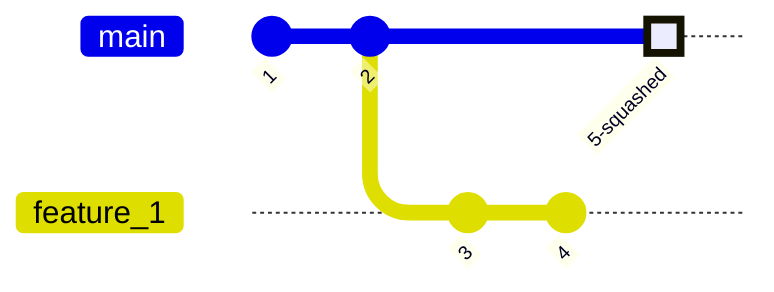
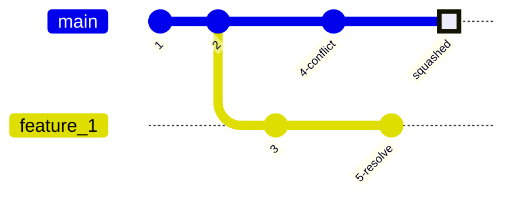
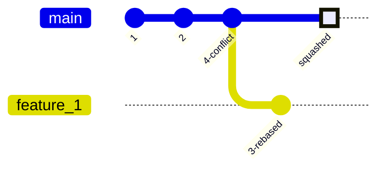
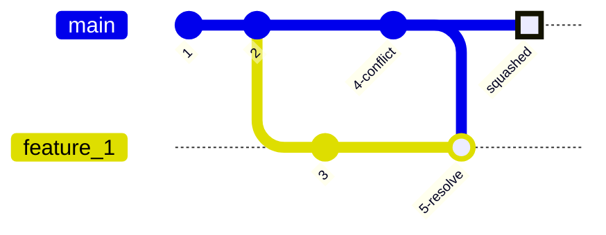
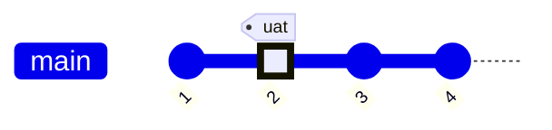
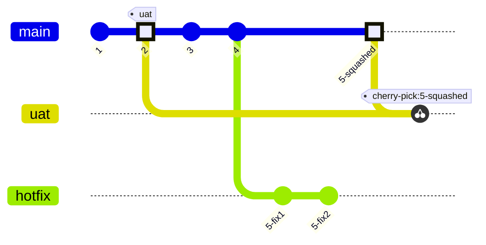
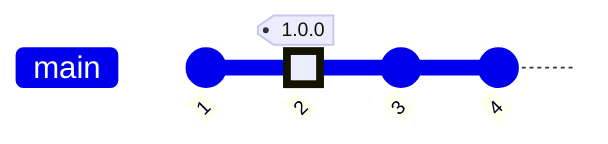
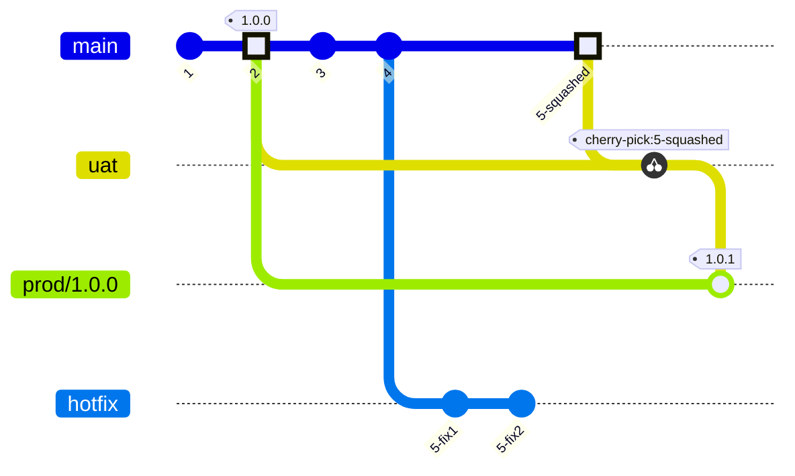
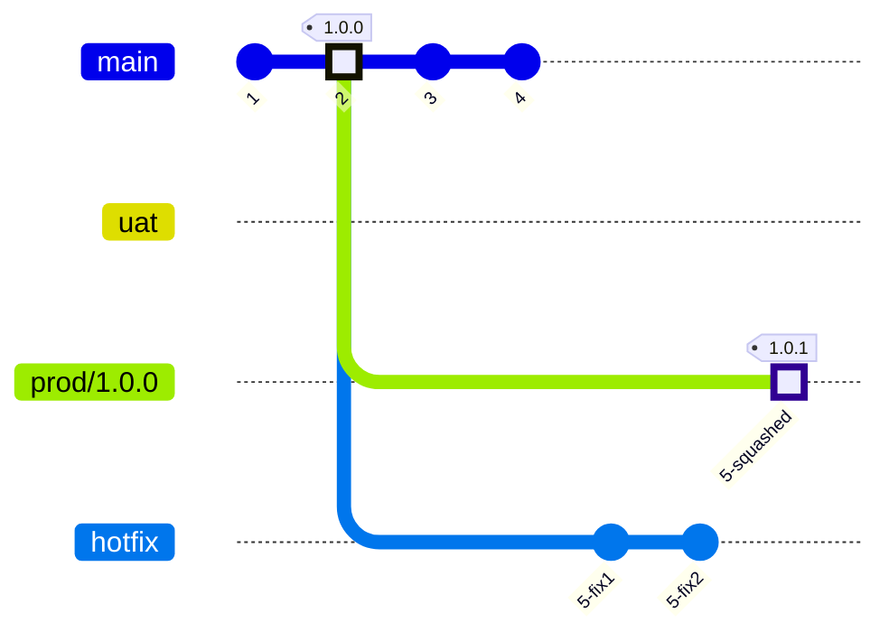

|Branch|Status|
|---|---|
|`main`|[](https://dl.circleci.com/status-badge/redirect/gh/eugene-hd/git-tmp/tree/main)|

# Git playground

This repository is for playing with git commands to practice the common work flows.

## Playgound rules
- Create a file/folder using your username so that others can play here too.
- Clean up after yourself by deleting files/branches/tags that you've created.

## Repository configuration

The repository is configured to aid us to follow a Trunk based development approach: https://trunkbaseddevelopment.com

|Branch|Created From|Merges To|CI|CD|CD Target Env|
|---|---|---|---|---|---|
|`main` (protected[^1])|-|-|yes|yes, changes only|dev|
|`feat/*` (short-lived)|`main`|`main` (squash)|yes|-|-|
|`bug/*` (short-lived)|`main`|`main` (squash)|yes|-|-|
|`uat` (protected)|`main`|-|yes|yes, full|uat|
|`prod/{x.y.z}` (protected)|`uat`|-|yes[^2]|yes, full|prod|
|`hotfix`[^3] (short-lived)|`uat`, `prod`|`uat`, `prod` (squash)|yes|-|-|

[^1] "Protected" branches cannot be written to directly. There are protection rules set up to ensure the integrity of the branches. Main rules are `Require a pull request before merging` and `Require status checks to pass before merging`.

[^2] Ideally this should take the already built artefacts from `uat` and simply deploy. TODO: investigate how to achieve this.

[^3] `hotfix` branch is used to apply a cherry-pick'ed fix that was done on the `main`(https://trunkbaseddevelopment.com/branch-for-release/#fix-production-bugs-on-trunk).
We use a dedicated `hotfix` branch because our `prod` is a **protected** branch, just like `uat` and `main`.

### Circle CI Integration
Circle CI is intergrated with GitHub as per https://circleci.com/docs/github-integration/. Essentially this allows GitHub to call CircleCI webhooks on various events, and allows CircleCI to report the status back to GitHub.


### Settings -> General
Pull requests: `Allow squash megring` only.
This ensures our history is more readable and understandable.

### Settings -> Branches
Branch protection rule is configured for `main`, `uat` and `prod/*` branches:
|Setting|value|
|---|---|
|Branch name pattern|`main` (create new rule for other branches)|
|Require a pull request before merging|yes|
|Require approvals|yes|
|Require status checks to pass before merging(select final job status that is present in all workflows)|yes|
|Require linear history|yes|
|Do not allow bypassing the above settings|yes|

The above rules ensure we can only commit to protected branch from a PR, after the approval and CI build is successful on the source(/feature) branch.

## Principles

Main guide: https://trunkbaseddevelopment.com

"A source-control branching model, where developers collaborate on code in a single branch called ‘trunk’, resist any pressure to create other long-lived development branches by employing documented techniques. They therefore avoid merge hell, do not break the build, and live happily ever after."

### Benefits
- The codebase is always releasable on demand and helps to make Continuous Delivery a reality.
- Ensures continuous code review. The rapid, small commits of trunk-based development make code review a more efficient process. With small branches, developers can quickly see and review small changes.
- Allows for fast iteration and feeedback and can eliminate costly and time-consuming merge conflicts at the end of long feature development cycles.

### Downsides
- Requires that there are experienced developers on the team. Junior or inexperienced members need a sufficient understanding of the workflow.

### General guidelines
Trunk-based development ensures teams release code quickly and consistently. The following is a list of exercises and practices that will help refine your team's cadence and develop an optimized release schedule.

- The main branch should always be production-ready. Faulty code can break the entire build and result in a complicated development history. That means that teams should thoroughly test each code change before pushing them to the main branch. Short development cycles and automated testing enable teams to identify defects and recover from failed builds quickly, reducing the risk.
- Develop in small batches. Small changes of a couple of commits or modification of a few lines of code minimize cognitive overhead. It's much easier for teams to have meaningful conversations and make quick decisions when reviewing a limited area of code versus a sprawling set of changes.
- Feature flags nicely compliment trunk-based development by enabling developers to wrap new changes in an inactive code path and activate it at a later time. This allows developers to forgo creating a separate repository feature branch and instead commit new feature code directly to the main branch within a feature flag path.
- Immediate code reviews. In trunk-based development, code review should be performed immediately and not put into an asynchronous system for later review. Automated tests provide a layer of preemptive code review. When developers are ready to review a team member's pull request, they can first check that the automated tests passed and the code coverage has increased. This gives the reviewer immediate reassurance that the new code meets certain specifications. The reviewer can then focus on optimizations.

### Rules
- `main` is branch is always "green". If not, fix it immediately as a **highest priority**. Fix may involve the actual fix to the logic, or a "revert" of the breaking commit if fix cannot be done quickly.
    - Developers(and/or Tech Leads) must address this promptly by identifying a person who will do the fix and communicating the progress to all developers.
- Code is committed to `main` only via PR from a feature or bug branch using **squash** merge commit.
- Code is committed to `uat` only via PR from a `main`(or `hotfix`) branch using **squash** merge commit.
    - It preferrable for hotfixes to be applied to `uat` first, so that the fix can be validated.
        - once validated in `uat`, a normal PR is created from `uat` to `prod`.
- Code is committed to `prod` only via PR from a `uat`(or `hotfix`) branch using **squash** merge commit.
    - In exceptional cases(due to urgency or bug not reproducable on `main`), a PR from `hotfix` to `prod` is created.
- `hotfix` is performed by a Senior develoiper only.


## Common workflows
### Implement feature - no conflicts

In this scenario, you checkout the feature branch, do your changes, create a PR, no conflicts detected, PR is approved and your changes are squash merged into base branch.
##### Steps
```
git pull
git checkout feature_1
# make changes
git add .
git commit -m"#1234: Implement a cool faeture"
# multiple commits on feature branch if needed
git push -u origin feature_1
# CI build is triggered
# Create a PR from feature_1 to main
# CI build pushes build status back to PR
# "Merge" button is activated if there are no conflicts and status checks pass
# PR is approved by a colleague by applying squash merge
# (squasing with cli when on main:) git merge --squash feature_1 
git branch -d feature_1
```

### Implement feature - resolve conflicts

In this scenario, you checkout the feature branch, do your changes, create a PR, conflicts are detected and resolved, PR is approved and your changes are squash merged into base branch.

In this case some other commit is made after you checked out feature branch and it has changes that conflict with your changes on the branch.

There are 2 ways to resolve this
#### Rebase feature branch
https://git-scm.com/book/en/v2/Git-Branching-Rebasing

Rebase is appropriate for feature braches only. Rebase should not be performed on remote branches!

##### Steps
```
# ...steps skipped until: PR created
# Conflict detected due to some other commit on main that has conflicting changes. If not on the banch already, then:
# git checkout feature_1
git rebase main
# ...
```

#### Merge main into feature branch
https://git-scm.com/book/en/v2/Git-Branching-Basic-Branching-and-Merging


##### Steps
```
# ...steps skipped until: PR created
# Conflict detected due to some other commit on main that has conflicting changes. If not on the banch already, then:
# git checkout feature_1
git merge main
# resolve conflicsts manually
git add .
git commit
# ...
```

### UAT - Prepare

In this scenario, we decide what features are to be locked in(1,2) for a release, so we identify the commit we want to branch `uat` from.
Simply create a `uat` branch from the commit. (TODO: test if build is automatically triggered on branch creation).

##### Steps
```
git pull
git checkout -b uat commit_id
git push -u origin uat
# CI/CD build is triggered
# Testers + users perform UAT
```
Note, you can also create a branch on GitHub site itself - https://stackoverflow.com/questions/60004952/creating-a-branch-from-git-commit-id-within-github-web-ui


### UAT - Fixing bug in UAT

A bug is found in UAT, fix is applied to `main` **first** and then cherry-picked to `uat`. https://trunkbaseddevelopment.com/branch-for-release/#fix-production-bugs-on-trunk.
It is critical to do this in this order to mitigate risks of regressions.


##### Steps
```
git checkout main
git pull
git checkout -b hotfix
# do fix
git add .
git commit -m"#1234: Fixed bug ..."
# more commits on hotfix branch if needed

# CI/CD build is triggered
# Create a PR from hotfix to main
# CI/CD build pushes build status back to PR
# "Merge" button is activated if there are no conflicts and status checks pass
# PR is approved by a colleague by applying squash merge
# (squasing with cli when on main:) git merge --squash hotfix

git checkout uat
git cherry-pick squashed_commit_id
git push -u origin uat
# CI build is triggered
# Testers + users perform UAT
```

Note, non-fix commits in `main` after the `uat` branch was created(3,4) are **not** included in `uat`, only the fix is applied.

### Release - Creating release

Release is created from the `uat` branch.
##### Steps
```
git pull
git checkout -b prod/1.0.0 uat
git push -u origin prod/1.0.0
# CI/CD build is triggered manually
# Smoke test on the prod environment, raise bugs if found
```
Tag `1.0.0` is created by CD pripeline as a last step. Tag value is resolved with the parameter provided to the release build at the time it is run.

### Release - Fixing bug in prod (standard flow)

A bug is found in `prod`, fix is applied to `main` **first** and then cherry-picked to `uat`. https://trunkbaseddevelopment.com/branch-for-release/#fix-production-bugs-on-trunk.
It is critical to do this in this order to mitigate risks of regressions.

Once tested on `uat` it is merged to `prod/{x.y.z}` branch. This is simpliy a fast-forward merge that moves `prod` branch tip to the cherry-picked fix on `uat` branch. A new release is done applying the `{x.y.z+1}` tag to the latest commit on the `prod` branch.

`uat` branch can be deleted now, or it can be kept for reference(to know what is in UAT environment) until the next release where it will need to be deleted and recreated from the commit for the next release. UAT environment will still be functional after `uat` branch is deleted.


##### Steps
```
git checkout main
git pull
git checkout -b hotfix
# do fix
git add .
git commit -m"#1234: Fixed bug ..."
# more commits on hotfix branch if needed

# CI build is triggered
# Create a PR from hotfix to main
# CI build pushes build status back to PR
# "Merge" button is activated if there are no conflicts and status checks pass
# PR is approved by a colleague by applying squash merge
# (squasing with cli when on main:) git merge --squash hotfix

# Delete hotfix branch locally and remotely
git branch -D hotfix
git push origin -d hotfix

git checkout uat
git cherry-pick squashed_commit_id
git push -u origin uat
# CI/CD build is triggered
# Testers + users perform UAT

git checkout prod/1.0.0
git merge uat
git push origin prod/1.0.0
# CI/CD build is triggered manually
# Smoke test on the prod environment, raise bugs if found

# Delete uat branch locally and remotely
git branch -D uat
git push origin -d uat
```

Note, non-fix commits in `main` after the `prod` branch was created(3,4) are **not** included in `prod`, only the fix is applied.

### Release - Fixing bug in prod ("risky" flow)

In this flow a bug cannot be reproduced on `main` or exceptional permission was granted to apply a fix directly on `prod`, due to urgency or other business requirements. Get a written sign off in this case.

There is a risk of introducing regressions using this flow, so it shall be performed as a last resort only. See details in https://trunkbaseddevelopment.com/branch-for-release/#fix-production-bugs-on-trunk.

##### Steps
```
git checkout prod/1.0.0
git pull
git checkout -b hotfix
# do fix
git add .
git commit -m"#1234: Fixed bug ..."
# more commits on hotfix branch if needed

# CI build is triggered
# Create a PR from hotfix to prod/1.0.0
# CI build pushes build status back to PR
# "Merge" button is activated if there are no conflicts and status checks pass
# PR is approved by a colleague by applying squash merge
# (squasing with cli when on prod branch:) git merge --squash hotfix

# CI/CD prod build is triggered manually with a new tag parameter
# Smoke test on the prod environment, raise bugs if found

# Delete hotfix branch locally and remotely
git branch -D hotfix
git push origin -d hotfix
```

Notes:
 - there is a risk of regression.
 - **no** UAT testing is done in this flow, as we are applying a fix directly on prod which is an additional risk.
 - non-fix commits in `main` after the `prod` branch was created(3,4) are **not** included in `prod`, only the fix is applied.